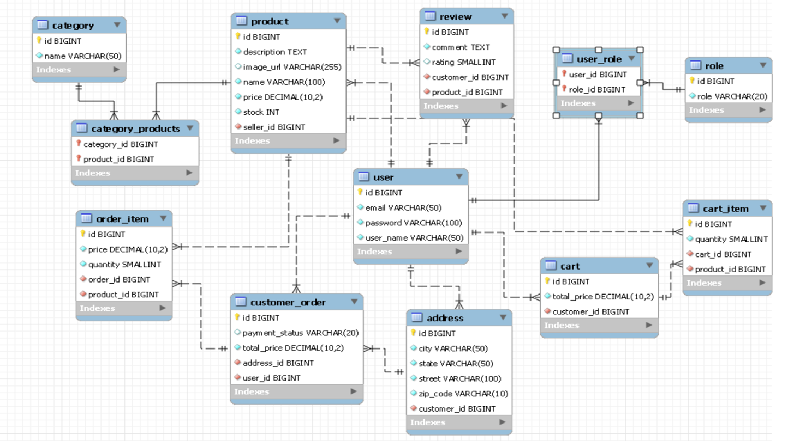

# Nexus Web Application

## Table of Contents
- [Project Description](#project-description)
- [Tech Stack](#tech-stack)
- [Features](#features)
- [Screenshots](#screenshots)
- [Development Setup](#development-setup)

## Project Description
#### - Etsy Clone is an e-commerce web application that allows users to buy and sell handmade or vintage items, art, and supplies. Users can create an account, list items for sale, and purchase items from other users.
#### - This project adopts a monolithic modular MVC architecture with clear layering and separation of concerns.

## Tech Stack
#### - Backend: Java, Spring Boot, Hibernate, MySQL
#### - Frontend: Thymeleaf, HTML, CSS, JavaScript

## Features
#### - Fully functional RESTful API with full CRUD operations
#### - User authentication and authorization with Spring Security and JWT
#### - Server Side Rendering
#### - Using DTOs to transfer data between layers
#### - Using Hibernate to interact with the database
#### - Using Lombok to reduce boilerplate code
#### - Using Thymeleaf to render HTML templates
#### - Using Bootstrap for styling
#### - Using JavaScript for client-side validation

## Screenshots
#### - ERD/Schema

## Development Setup

